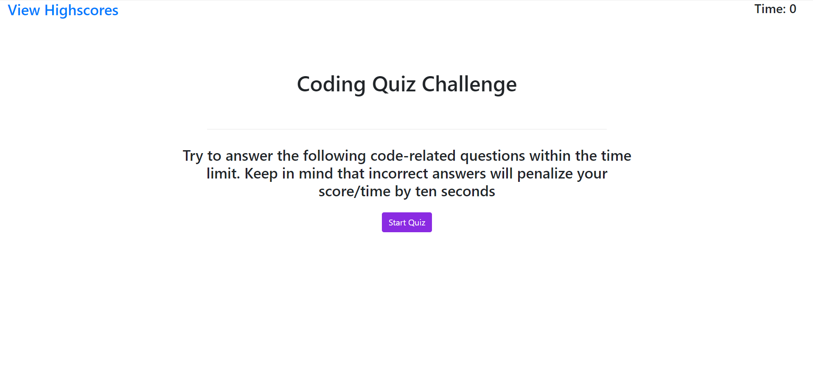
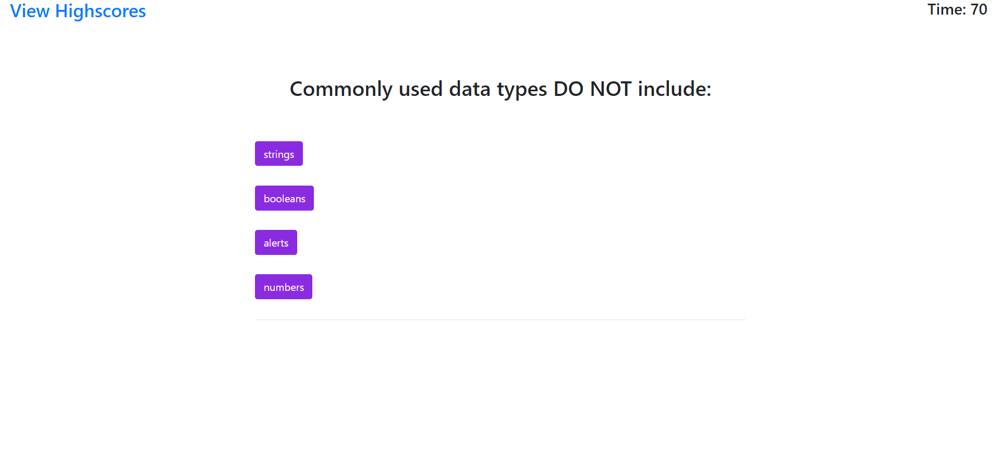
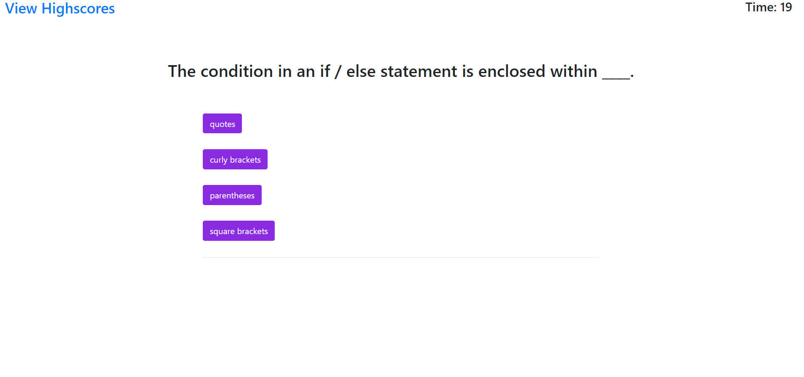
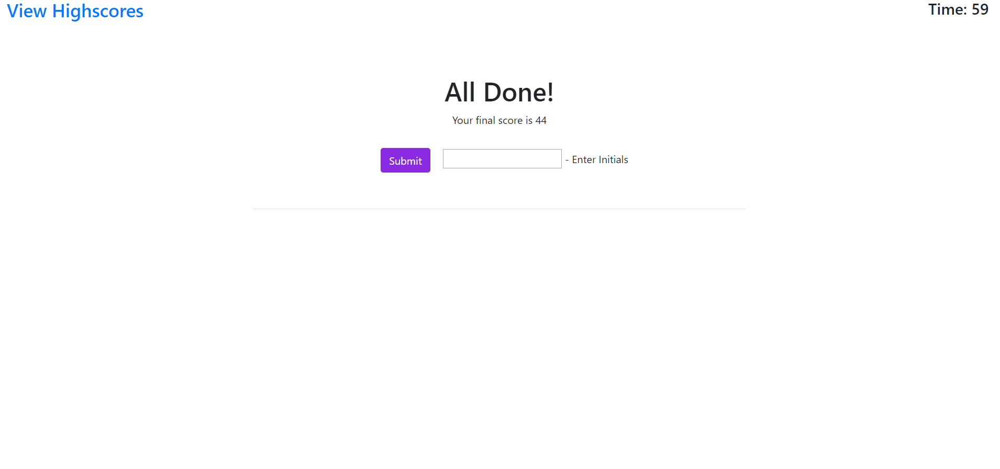
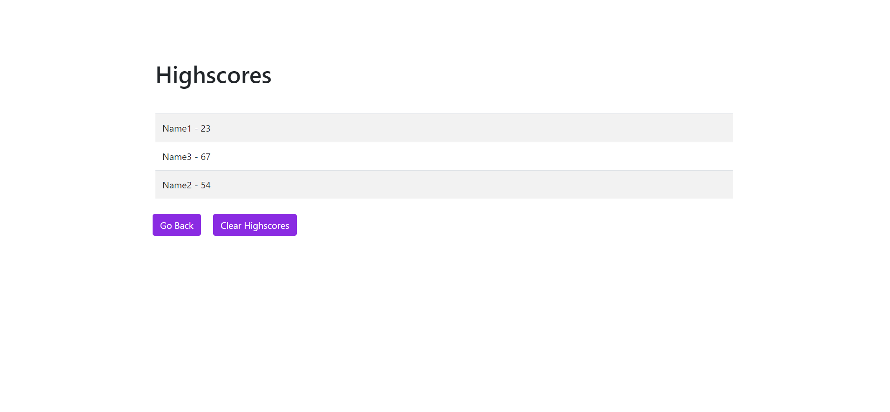

# Coding Quiz

This repo is for the UNCC coding bootcamp

## Instructions

Create a webpage that shows a landing page with a call-to-action for a quiz.

Pressing "Start Quiz" button should initialize timer, hide initial page content, and replace it with a dynamically generated question and answer buttons. (With the questions being kept in a separate js file)

Incorrect answers subtract time from timer, while correct answers add to user's score.

The end of the quiz will generate an end screen where user can submit their initials along with their score from the quiz.

Clicking the link to view highscores will bring user to a table of locally stored highscores.

## Screenshot

   
   
   
   
   

### Links

[Github Repo](https://github.com/Goldpm/HW4-Coding-Quiz-Challenge)

[Completed Work](https://adam-lowe.github.io/Coding-Quiz-Challenge/)
